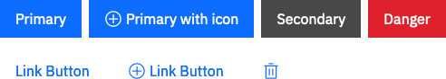
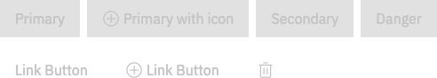

# Buttons

Buttons are used to perform an action. The main buttons in the application are the `primary` and `secondary` buttons. Buttons, like all Boostrap-vue components can be themed by setting the `variant` prop on the component to one of the [theme-color map keys](/guide/guidelines/colors). To create a button that looks like a link, set the variant value to `link`.

[Learn more about Bootstrap-vue buttons](https://bootstrap-vue.js.org/docs/components/button)

### Icon only buttons
Add `btn-icon-only` class to the button and set the variant value to `link`. Also add `title` attribute to get helper text on hover over the button. 

### Enabled buttons



### Disabled buttons




```vue
// Enabled Buttons
<b-button variant="primary">Primary</b-button>
<b-button variant="secondary">Secondary</b-button>
<b-button variant="danger">Danger</b-button>

// Disabled Buttons
<b-button disabled variant="primary">Disabled</b-button>

// Buttons Icon Only
<b-button variant="link" class="btn-icon-only">
  <icon-add />
</b-button>

// Link Buttons
<b-button variant="link">Link Button</b-button>
<b-button variant="link">
  <icon-add />
  <span>Link Button</span>
</b-button>
```