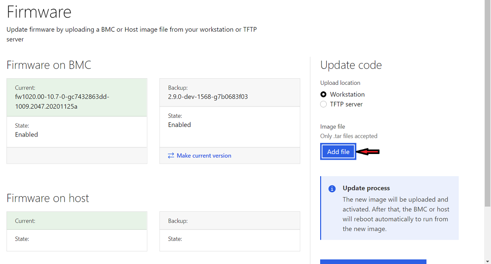

# FormFile

`FormFile` is a custom component wrapper around the Bootstrap-vue Form File
component. The purpose of this component is to upload files to the BMC.

To use this component:
1. Import it into the single file component (SFC)
2. Add the `<form-file />` tag
3. Add the optional `id` , `disabled`, `accept` and `state` prop as required

[Learn more about the Bootstrap-vue Form File
component](https://bootstrap-vue.org/docs/components/form-file)
### Optional properties

- `id`- Used to set the `id` attribute on the rendered content, and used as the
  base to generate any additional element IDs as needed
- `disabled` - When set to `true`, disables the component's functionality and
  places it in a disabled state
- `accept` - Set value to specify which file types to allow
- `state` - Controls the validation state appearance of the component. `true`
  for valid, `false` for invalid, or `null` for no validation state

## Example of form file

```vue
<form-file
  id="image-file"
  accept=".tar"
  >
</form-file>
```


