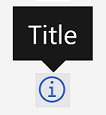

# InfoTooltip

The `InfoTooltip` is a custom component that uses a Bootstrap-vue tooltip with
an info icon. This custom component requires a title property containing the
tooltip text to display to the user.

[Read more about the Bootstrap-vue tooltip
component](https://bootstrap-vue.org/docs/components/tooltip)

## Example

```vue
<info-tooltip
  :title="Title" //should be translated
/>
```


