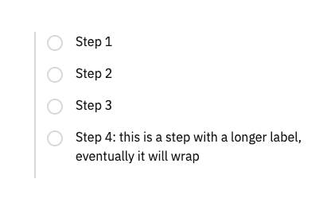
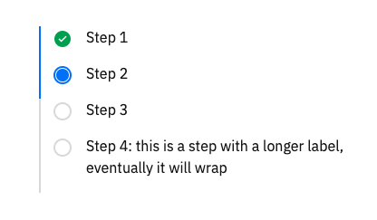
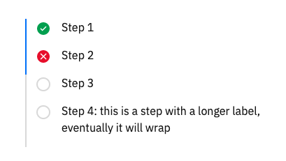
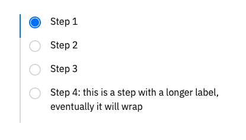

# Progress indicator

The progress indicator is a custom component, with patterns borrowed from the [Carbon Design System](https://www.carbondesignsystem.com/components/progress-indicator/usage).

>A progress indicator is a visual representation of a user’s progress through a set of steps, guiding toward the completion of a specified process.

To use the this component
1. Import the `ProgressIndicator.vue` component
2. Add the `<progress-indicator />` tag into the template
3. Provide a `steps` prop that should be an array of objects that includes a `label` property
4. Add a `ref` attribute to the `<progress-indicator />` element

### Default progress indicator

```vue
<template>
  <progress-indicator ref="progressIndicator" :steps="steps" />
</template>

<script>
  export default {
    data() {
      return {
        steps: [
          { label: 'Step 1' },
          { label: 'Step 2' },
          { label: 'Step 3' },
          {
            label:
              'Step 4: this is a step with a longer label, eventually it will wrap',
          },
        ]
      }
    }
  }
</script>

```





### Current and completed steps

To show a step is in progress and move through the different steps, call the `next` method on the component, using the `$refs` object. Each time `next` is called on the component ref, the previous step will complete and the current step will move forward.

```js
someAPIcall.then(() => this.$refs.progressIndicator.next())
```




### Error step

To show an error in the step, call the `showError` method on the component. This will default to show an error on the current step, but an index value can be optionally passed to show an error on a step that is not the current step.

```js
someAPIcall.catch(() => this.$refs.progressIndicator.showError(1))
```



### Optional start prop

An optional `start` prop can be provided to the component. The value will immediately start the progress indicator on the index value provided.

```vue
<template>
  <progress-indicator
    ref="progressIndicator"
    :steps="steps"
    start="0"
  />
</template>
```

