# Table

All tables in the application are using the [BoostrapVue table
component](https://bootstrap-vue.org/docs/components/table).

To use the component, include the `<b-table>` tag in the template. The component
is registered globally so does not need to be imported in each SFC.

## Basic table
There are a few required properties to maintain consistency across the
application. The full list of options can be viewed on the [Bootstrap-vue table
component's documentation
page](https://bootstrap-vue.org/docs/components/table#comp-ref-b-table-props).


### Required properties

- `items` - renders table items
- `fields` - renders table header
- `hover` - enables table row hover state
- `responsive` or `stacked` - makes the table responsive (enables horizontal
  scrolling or stacked view) at the defined breakpoint
- `show-empty` *(required if table data is generated dynamically)* - shows an
  empty message if there are no items in the table
- `empty-text` *(required if table data is generated dynamically)* - the
  translated empty message

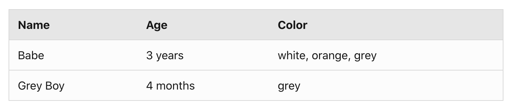 

```vue
<template>
  <b-table
    hover
    show-empty
    responsive="md"
    :items="items"
    :fields="fields"
    :empty-text="$t('global.table.emptyMessage')"
  />
</template>

<script>
  export default {
    data() {
      items: [
        {
          name: 'Babe',
          age: '3 years',
          color: 'white, orange, grey'
        },
        {
          name: 'Grey Boy',
          age: '4 months',
          color: 'grey'
        },
      ],
      fields: [
        {
          key: 'name',
          label: this.$t('table.name') //translated label
        },
        {
          key: 'age',
          label: this.$t('table.age') //translated label
        },
        {
          key: 'color',
          label: this.$t('table.color') // translated label
        }
      ]
    }
  }
</script>
```

## Sort

To enable table sort, include `sortable: true` in the fields array for sortable
columns and add the following props to the `<b-table>` component:

- `sort-by`
- `no-sort-reset`
- `sort-icon-left`

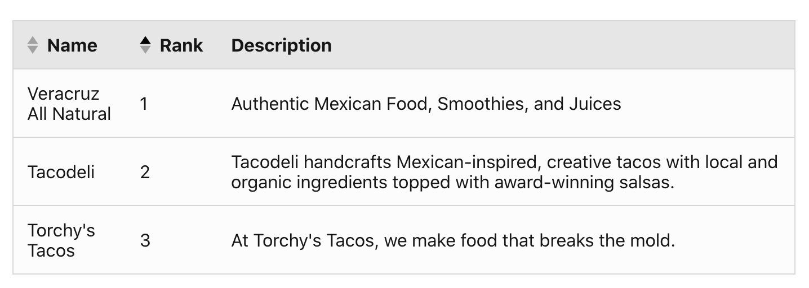


```vue
<template>
  <b-table
    hover
    no-sort-reset
    sort-icon-left
    sort-by="rank"
    responsive="md"
    :items="items"
    :fields="fields"
  />
</template>
<script>
export default {
  data() {
    return {
      items: [...],
      fields: [
        {
          key: 'name',
          label: 'Name', //should be translated
          sortable: true
        },
        {
          key: 'rank',
          label: 'Rank', //should be translated
          sortable: true
        },
        {
          key: 'description',
          label: 'Description', //should be translated
          sortable: false
        }
      ]
    }
  }
}
</script>
```

## Expandable rows

To add an expandable row in the table, add a column for the expand button in the
fields array. Include the tdClass `table-row-expand` to ensure icon rotation is
handled. Use the built in [cell
slot](https://bootstrap-vue.org/docs/components/table#comp-ref-b-table-slots) to
target the expand button column and add a button with the chevron icon.

Include the
[TableRowExpandMixin](https://github.com/openbmc/webui-vue/blob/master/src/components/Mixins/TableRowExpandMixin.js).
The mixin contains the dynamic `aria-label` and `title` attribute values that
need to be included with the expand button. The `toggleRowDetails` method should
be the button's click event callback. Be sure to pass the `row` object to the
function.

Use the [row-details
slot](https://bootstrap-vue.org/docs/components/table#comp-ref-b-table-slots) to
format the expanded row content. The slot has access to the row `item` property.

### Summary

1. Add a column for the expansion row button with the tdClass,
   `table-row-expand`
2. Include the `TableRowExpandMixin` to handle the dynamic aria label, title,
   and row expansion toggling
3. Use the `#cell` slot to target the expandable row column and add the button
   with accessible markup and click handler
4. Use the `#row-details` slot to format expanded row content

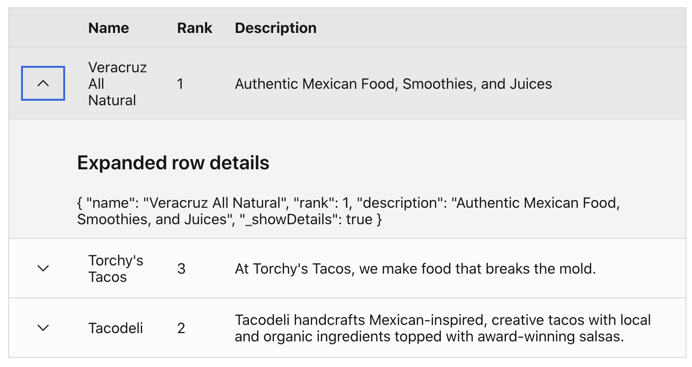

```vue
<template>
  <b-table
    hover
    responsive="md"
    :items="items"
    :fields="fields"
  >
    <template #cell(expandRow)="row">
      <b-button
        variant="link"
        :aria-label="expandRowLabel"
        :title="expandRowLabel"
        @click="toggleRowDetails(row)"
      >
        <icon-chevron />
      </b-button>
    </template>
    <template #row-details="row">
      <h3>Expanded row details</h3>
      {{ row.item }}
    </template>
  </b-table>
</template>
<script>
import IconChevron from '@carbon/icons-vue/es/chevron--down/20';
import TableRowExpandMixin, { expandRowLabel } from '@/components/Mixins/TableRowExpandMixin';

export default {
  components: { IconChevron },
  mixins: [ TableRowExpandMixin ],
  data() {
    return {
      items: [...],
      fields: [
        {
          key: 'expandRow',
          label: '',
          tdClass: 'table-row-expand',
        },
        ...
      ],
      expandRowLabel
    }
  }
}
</script>
```

## Search

The table is leveraging [BootstrapVue table
filtering](https://bootstrap-vue.org/docs/components/table#filtering) for
search. Add the
[@filtered](https://bootstrap-vue.org/docs/components/table#filter-events) event
listener onto the `<b-table>` component. The event callback should track the
total filtered items count.

Import the `<search>` and `<table-cell-count>` components and include them in
the template above the `<b-table>` component.

Include the
[SearchFilterMixin](https://github.com/openbmc/webui-vue/blob/master/src/components/Mixins/SearchFilterMixin.js).
Add the `@change-search` and `@clear-search` event listeners on the `<search>`
component and use the corresponding `onChangeSearchInput` and
`onClearSearchInput` methods as the event callbacks. The table should also
include the dynamic `:filter` prop with `searchFilter` set as the value.

The `<table-cell-count>` component requires two properties, total table item
count and total filtered items count.

Add the `:empty-filtered-text` prop to the table to show the translated message
if there are no search matches.

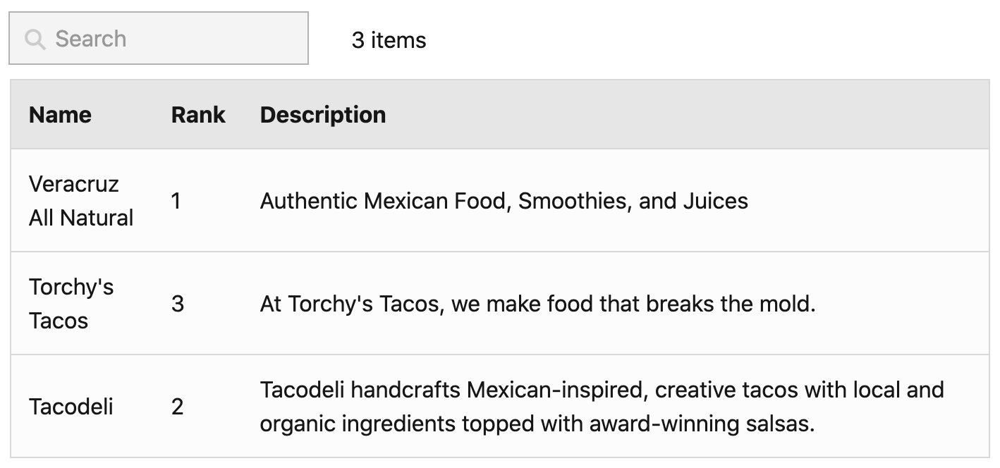

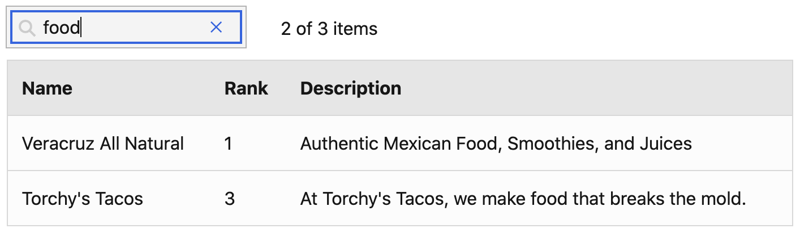

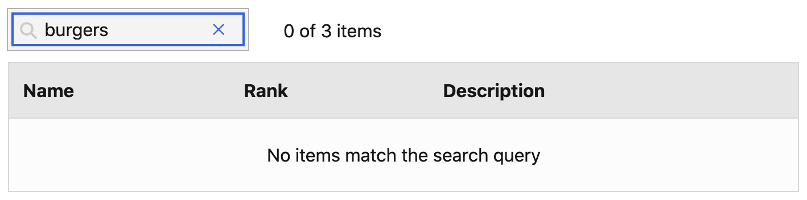

```vue
<template>
  <b-container>
  <b-row>
    <b-col>
      <search
        @changeSearch="onChangeSearchInput"
        @clearSearch="onClearSearchInput"
      />
    </b-col>
    <b-col>
      <table-cell-count
        :filtered-items-count="filteredItemsCount"
        :total-number-of-cells="items.length"
      />
    </b-col>
  </b-row>
  <b-table
    hover
    responsive="md"
    :items="items"
    :fields="fields"
    :filter="searchFilter"
    :empty-filtered-text="$t('global.table.emptySearchMessage')"
    @filtered="onFiltered"
  />
  </b-container>
</template>
<script>
import Search from '@/components/Global/Search';
import TableCellCount from '@/components/Global/TableCellCount';
import SearchFilterMixin, { searchFilter } from '@/components/Mixins/SearchFilterMixin';

export default {
  components: { Search, TableCellCount },
  mixins: [ SearchFilterMixin ],
  data() {
    return {
      items: [...],
      fields: [...],
      searchFilter,
      filteredItems: [],
    }
  },
  computed: {
    filteredItemsCount() {
      return this.filteredItems.length;
    },
  },
  methods: {
    onFiltered(items) {
      this.filteredItems = items;
    },
  },
}
</script>
```

## Row actions

To add table row actions, add a column for the action buttons in the table. Then
in the array of table items, add a corresponding array of actions for each item.
The array should have each desired row action with a `value` and `title`
property.

Import the `<table-row-action>` component. Provide the `value` and `title` props
to the component and use the named `#icons` slot to include an icon. The
component will emit a `@click-table-action` with the event value.

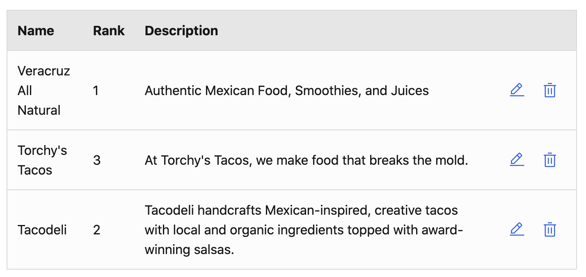

```vue
<template>
  <b-table
    hover
    responsive="md"
    :items="itemsWithActions"
    :fields="fields"
  >
    <template #cell(actions)="row">
      <table-row-action
        v-for="(action, index) in row.item.actions"
        :key="index"
        :value="action.value"
        :title="action.title"
        @click-table-action="onTableRowAction($event, row.item)"
      />
        <template #icon>
          <icon-edit v-if="action.value === 'edit'"/>
          <icon-delete v-if="action.value === 'delete'"/>
        </template>
      </table-row-action>
    </template>
  </b-table>
</template>
<script>
import IconDelete from '@carbon/icons-vue/es/trash-can/20';
import IconEdit from '@carbon/icons-vue/es/edit/20';
import TableRowAction from '@/components/Global/TableRowAction';

export default {
  components: { IconDelete, IconEdit, TableRowAction },
  data() {
    return {
      items: [...],
      fields: [
        ...,
        {
          key: 'actions',
          label: '',
          tdClass: 'text-right text-nowrap',
        }
      ],
    }
  },
  computed: {
    itemsWithActions() {
      return this.items.map((item) => {
        return {
          ...item,
          actions: [
            {
              value: 'edit',
              title: this.$t('global.action.edit'),
            },
            {
              value: 'delete',
              title: this.$t('global.action.delete'),
            },
          ],
        };
      });
    }
  },
  methods: {
    onTableRowAction(event, row) {
      // row action callback
    }
  }
}
</script>
```

## Filters

To add a table dropdown filter:
1. Import the `<table-filter> `component and TableFilterMixin.
1. Add a filters prop to the `<table-filters>` component. This prop should be an
   array of filter groups–each required to have a key, label, and values prop.

The `label` prop value should be the translated filter group label. The `key`
prop will usually match the filtered by table column key. The `values` prop
should be an array of filter values that will render as a list of checkbox items
in the dropdown.

The component will emit a `@filter-change` event that will provide the filter
group and all selected values in the group. Use the getFilteredTableData method
from the TableFilterMixin to show the filtered table data.

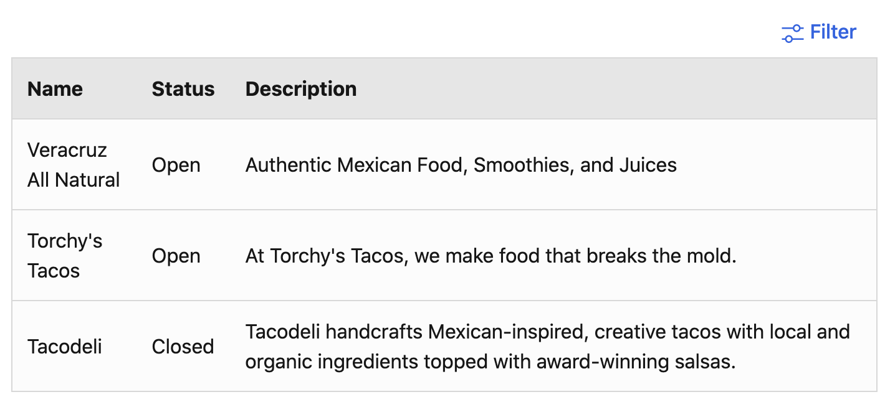

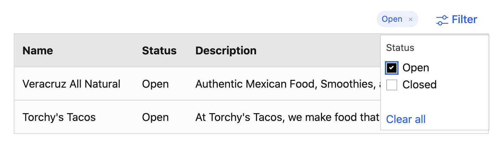

```vue
<template>
  <b-container>
    <b-row>
      <b-col class="text-right">
        <table-filter
          :filters="tableFilters"
          @filter-change="onTableFilterChange"
        />
      </b-col>
    </b-row>
    <b-table
      hover
      responsive="md"
      :items="filteredItems"
      :fields="fields"
    />
  </b-container>
</template>
<script>
import TableFilter from '@/components/Global/TableFilter';
import TableFilterMixin from '@/components/Mixins/TableFilterMixin';

export default {
  components: { TableFilter },
  mixins: [ TableFilterMixin ],
  data() {
    return {
      items: [...],
      fields: [...],
      tableFilters: [
        {
          label: this.$t('table.status'),
          key: status,
          values: ['Open', 'Closed']
        }
      ],
      activeFilters: [],
    },
  },
  computed: {
    filteredItems() {
      return this.getFilteredTableData(this.items, this.activeFilters);
    },
  },
  methods: {
    onTableFilterChange({ activeFilters }) {
      this.activeFilters = activeFilters;
    },
  },
}
</script>
```


### Date filter

To add a date filter, import the `<table-date-filter>` component. It will emit a
`@change` event with the user input date values. There is a date filter method,
`getFilteredTableDataByDate`, in the `TableFilterMixin`.


## Batch actions

Batch actions allow a user to take a single action on many items in a table at
once.

To add table batch actions:
1. Import the `<table-toolbar> `component and BVTableSelectableMixin
1. Add the `selectable`, `no-select-on-click` props and a unique `ref` to the
   table. The table will emit a `@row-selected` event. Use the `onRowSelected`
   mixin method as a callback and provide the `$event` as the first argument and
   the total table items count as the second argument.
1. Add a table column for checkboxes. The table header checkbox should use the
   `tableHeaderCheckboxModel` and `tableHeaderCheckboxIndeterminate` values
   provided by the mixin. The table header checkbox should also use the
   `onChangeHeaderCheckbox` method as a callback for the `@change` event with
   the table `ref` passed as an argument. The table row checkboxes should use
   the `toggleSelectRow` method as a callback for the `@change` event with the
   table `ref` passed as the first argument and the row index passed as the
   second argument.
1. Add an actions prop to the `<table-toolbar>` component. This prop should be
   an array of toolbar actions–required to have a value and label prop. Add the
   `selected-items-count` prop to the `<table-toolbar>` component. The component
   will emit a `@batch-action` event that will provide the user selected action.
   It will also emit a `@clear-selected` event. Provide the `clearSelectedRows`
   as a callback with the table `ref` passed as an argument.

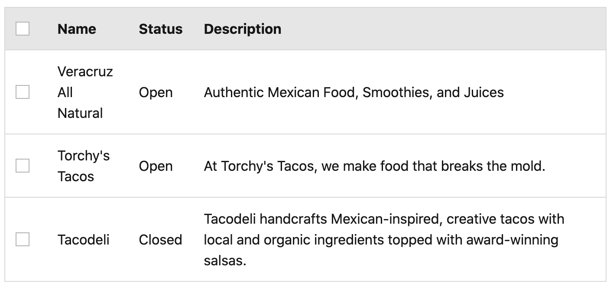

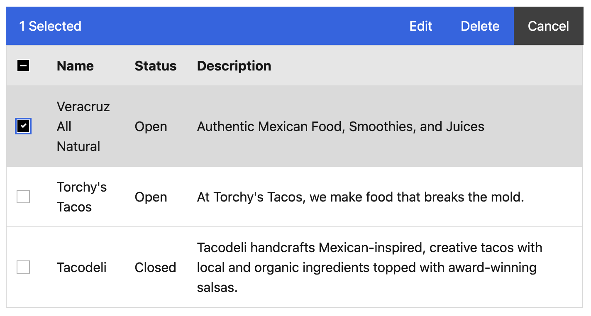

```vue
<template>
  <b-container>
    <table-toolbar
      :selected-items-count="selectedRows.length"
      :actions="tableToolbarActions"
      @clear-selected="clearSelectedRows($refs.table)"
      @batch-action="onBatchAction"
    />
    <b-table
      ref="table"
      hover
      selectable
      no-select-on-click
      responsive="md"
      :items="filteredItems"
      :fields="fields"
      @row-selected="onRowSelected($event, items.length)"
    >
      <template #head(checkbox)>
        <b-form-checkbox
          v-model="tableHeaderCheckboxModel"
          :indeterminate="tableHeaderCheckboxIndeterminate"
          @change="onChangeHeaderCheckbox($refs.table)"
        />
      </template>
      <template #cell(checkbox)="row">
        <b-form-checkbox
          v-model="row.rowSelected"
          @change="toggleSelectRow($refs.table, row.index)"
        />
      </template>
    </b-table>
  </b-container>
</template>
<script>
import TableToolbar from '@/components/Global/TableToolbar';
import BVTableSelectableMixin, {
  tableHeaderCheckboxModel,
  tableHeaderCheckboxIndeterminate,
  selectedRows
} from '@/components/Mixins/BVTableSelectableMixin';

export default {
  components: { TableToolbar },
  mixins: [ BVTableSelectableMixin ],
  data() {
    return {
      items: [...],
      fields: [
        {
          key: 'checkbox'
        },
        ...
      ],
      tableToolbarActions: [
        {
          value: 'edit',
          label: this.$t('global.action.edit')
        },
        {
          value: 'delete',
          label: this.$t('global.action.delete')
        },
      ],
      tableHeaderCheckboxModel,
      tableHeaderCheckboxIndeterminate,
      selectedRows
    },
  },
  methods: {
    onBatchAction(action) {
      // Do something with selected batch action and selected rows
    },
  },
}
</script>
```


## Pagination

To add table pagination:
1. Import the BVPaginationMixin
1. Add the `per-page` and `current-page` props to the `<table>` component.
1. Add the below HTML snippet to the template. Make sure to update the
   `total-rows` prop.

```vue{21}
<b-row>
  <b-col sm="6">
    <b-form-group
      class="table-pagination-select"
      :label="$t('global.table.itemsPerPage')"
      label-for="pagination-items-per-page"
    >
      <b-form-select
        id="pagination-items-per-page"
        v-model="perPage"
        :options="itemsPerPageOptions"
      />
    </b-form-group>
  </b-col>
  <b-col sm="6">
    <b-pagination
      v-model="currentPage"
      first-number
      last-number
      :per-page="perPage"
      :total-rows="getTotalRowCount(items.length)"
      aria-controls="table-event-logs"
    />
  </b-col>
</b-row>
```
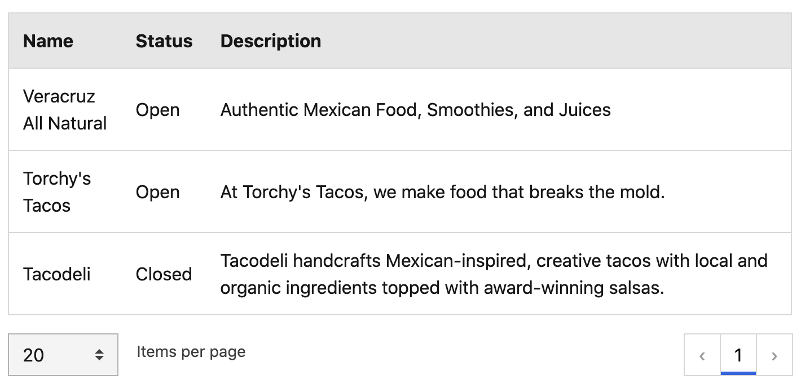

```vue
<template>
  <b-container>
    <b-table
      hover
      responsive="md"
      :items="filteredItems"
      :fields="fields"
      :per-page="perPage"
      :current-page="currentPage"
    />
    <b-row>
      <b-col sm="6">
        <b-form-group
          class="table-pagination-select"
          :label="$t('global.table.itemsPerPage')"
          label-for="pagination-items-per-page"
        >
          <b-form-select
            id="pagination-items-per-page"
            v-model="perPage"
            :options="itemsPerPageOptions"
          />
        </b-form-group>
      </b-col>
      <b-col sm="6">
        <b-pagination
          v-model="currentPage"
          first-number
          last-number
          :per-page="perPage"
          :total-rows="getTotalRowCount(items.length)"
          aria-controls="table-event-logs"
        />
      </b-col>
    </b-row>
  </b-container>
</template>
<script>
import BVPaginationMixin, {
  currentPage,
  perPage,
  itemsPerPageOptions
} from '@/components/Mixins/BVPaginationMixin';

export default {
  mixins: [ BVPaginationMixin ],
  data() {
    return {
      items: [...],
      fields: [..],
      currentPage,
      perPage,
      itemsPerPageOptions
    },
  }
}
</script>
```