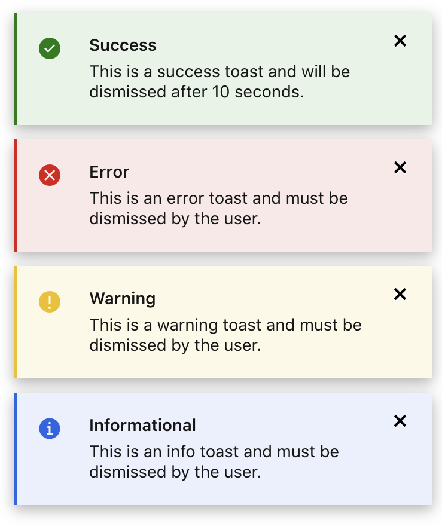
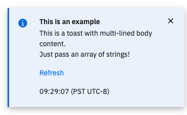

# Toasts
Use a toast message to indicate the status of a user action. For example, a user
saves a form successfully, a toast message with the `success` variant is
displayed.  If the user action was not successful, a toast message with the
`danger` variant is displayed.

There are different transitions for the toast messages. The `success` toast
message will auto-hide after 10 seconds. The user must manually dismiss the
`informational`, `warning`, and `error` toast messages.  The `BVToastMixin`
provides a simple API that generates a toast message that meets the transition
guidelines.



```js{5}
// Sample method from Reboot BMC page
rebootBmc() {
  this.$store
  .dispatch('controls/rebootBmc')
  .then(message => this.successToast(message))
  .catch(({ message }) => this.errorToast(message));
}

// Methods used in this example
methods: {
  makeSuccessToast() {
    this.successToast('This is a success toast and will be dismissed after 10 seconds.');
  },
  makeErrorToast() {
    this.errorToast('This is an error toast and must be dismissed by the user.');
  },
  makeWarningToast() {
    this.warningToast('This is a warning toast and must be dismissed by the user.');
  },
  makeInfoToast() {
    this.infoToast('This is an info toast and must be dismissed by the user.');
  },
}
```

## Additional options

The first argument for each method will be the toast body content. It accepts a
string value or an array of strings for toasts needing to display multiple lines
of content.

The BVToastMixin also accepts additional options as a second argument. Pass an
object with a `title` property to change the default toast title. Include a
`refreshAction` property, set to true, to include a link that refreshes the
application. Include a `timestamp` property, set to true, to include a timestamp
in the toast.



```js

methods: {
  makeInfoToast() {
    this.infoToast([
      'This is a toast with multi-lined body content.',
      'Just pass an array of strings!'
      ], {
      title: 'This is an example',
      refreshAction: true,
      timestamp: true
    })
  }
}
```